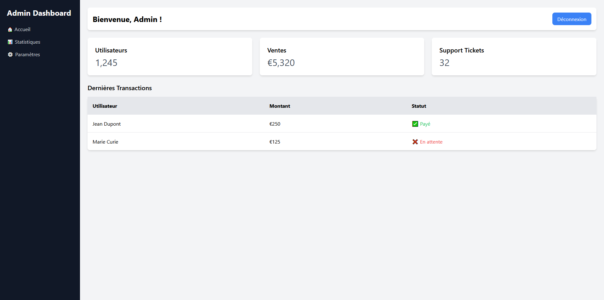

# 🖥️ Dashboard Minimaliste avec TailwindCSS  

Ce projet est un dashboard simple et responsive conçu avec **TailwindCSS**. Il comprend une sidebar, une section statistiques, et un tableau de données.  
L'objectif est d'apprendre à utiliser TailwindCSS pour structurer rapidement une page avec Flexbox, Grid et des styles utilitaires.

📖 **Documentation officielle TailwindCSS** : [https://tailwindcss.com/docs](https://tailwindcss.com/docs)

📌 **Aperçu du résultat final** :  


---

## 🚀 Installation et Lancement  

* **Cloner le repo**
* **Ajouter TailwindCSS via CDN** en insérant ce script dans `<head>` :  
   ```html
   <script src="https://cdn.tailwindcss.com"></script>
   ```
* **Faire la structure de la page** et ajouter les **classes utilitaires**

💡 Aucune installation de dépendances n'est nécessaire pour ce workshop, Tailwind est chargé via CDN.

---

## 🎯 Objectif du Workshop  

Pendant ce workshop, vous allez créer un **dashboard** minimaliste avec TailwindCSS. Il sera composé de :  

✅ Une **sidebar fixe** avec une navigation  
✅ Un **header** avec un message de bienvenue et un bouton  
✅ Une **section de statistiques** avec des cartes  
✅ Un **tableau de transactions** 

🔹 Les tailles exactes des paddings, marges et espacements ne sont pas imposées !

Si votre mise en page semble trop serrée ou trop espacée, n’hésitez pas à ajuster les valeurs (p-4, m-6, gap-4, etc.).

L’important est de comprendre comment Tailwind fonctionne, pas de recopier pixel par pixel le design.

---

### 🛠️ Étapes à suivre  

1. **Ajoutez une sidebar fixe** avec des liens de navigation.  
2. **Ajoutez un header**.  
3. **Ajoutez des cartes de statistiques** (Utilisateurs / Ventes / Support Tickets) avec de fausses données.  
4. **Ajoutez un tableau** avec les dernières transactions :  
   - Colonnes : **Utilisateur - Montant - Statut**  
   - Afficher un **nom et prénom**, un **montant**, et un **statut** :  
     - **✅ Payé** → Texte en **vert**  
     - **🟠 En attente** → Texte en **orange**  
     - **❌ Non payé** → Texte en **rouge**  
